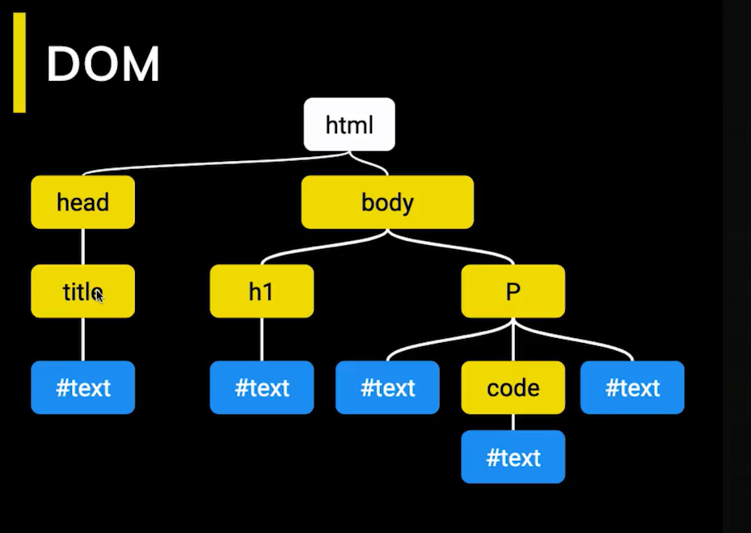
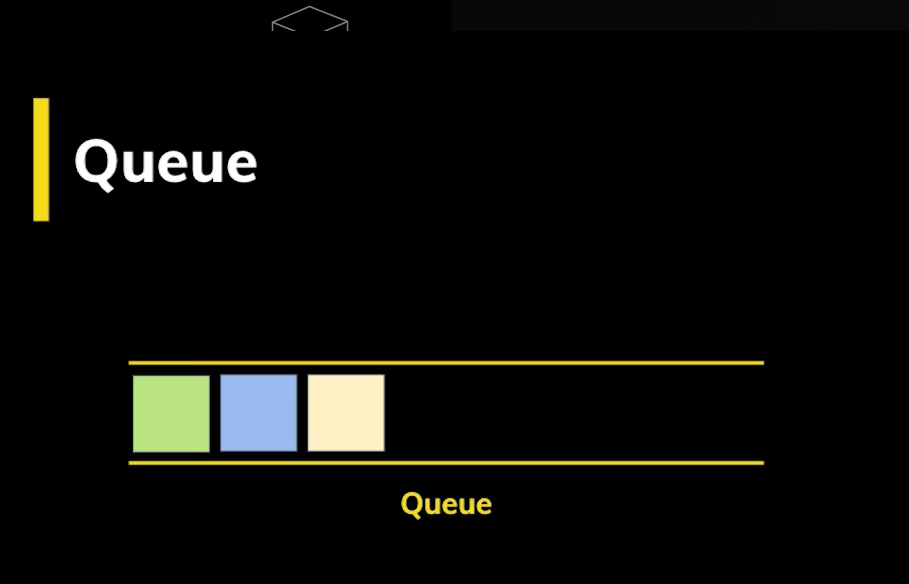

# Platzi - curso profesional javascript
[curso](https://platzi.com/cursos/javascript-profesional/)  

# Promises

# Getter and setter

# Generators
```javascript

```
# Proxy

# prototype inheritance

# dev dependencies
- are required for development
- useful for running scripts
```shell
npm i -D live-server 
```

# html - video

```html
<main class="container">
      <video class="movie" controls>
        <source src="./assets/intro.mp4" type="video/mp4">
      </video>

      <button id="playButton">Play/Pause</button>
      <button id="muteButton">Mute/Unmute</button>
    </main>
```

```javascript
const video = document.querySelector(".movie");
const playButton = document.querySelector("#playButton");
const muteButton = document.querySelector("#muteButton");
playButton.onclick = () => {
  if (video.paused) {
    video.play();
    playButton.textContent = "Pause";
  } else {
    video.pause();
    playButton.textContent = "Play";
  }
};
```

```javascript
muteButton.onclick = () => {
  if (video.muted) {
    video.muted = false;
    muteButton.textContent = "Mute";
  } else {
    video.muted = true;
    muteButton.textContent = "Unmute";
  }
};
```

# prototype
1. create a function
2. extend that function object using prototype
3. instantiate a new function object

conclusions:
- for each new method in the class, you should use "function" word to keep the context

-  refer prototype properties using this.

- enclose events in an arrow, they has their own context

```javascript
function MediaPlayer(idMedia, idPlayButton, idMuteButton){
  this.media = document.querySelector(idMedia);
  this.playButton = document.querySelector(idPlayButton);
  this.muteButton = document.querySelector(idMuteButton);

  this.playButton.onclick = () => {
    this.play();
  }
  this.muteButton.onclick = () => {
    this.mute();
  };
}

MediaPlayer.prototype.play = function(){
  if (this.media.paused) {
    this.media.play();
    this.playButton.textContent = "Pause";
  } else {
    this.media.pause();
    this.playButton.textContent = "Play";
  }
}

MediaPlayer.prototype.mute = function(){
  if (this.media.muted) {
    this.media.muted = false;
    this.muteButton.textContent = "Mute";
  } else {
    this.media.muted = true;
    this.muteButton.textContent = "Unmute";
  }
}

const player = new MediaPlayer(".movie", "#playButton", "#muteButton");
```

# Single thread
JS engine uses one thread, if one script is in execution, the engine DOM stops, therefore you should load all the content before starts any process

# DOM
  

# DomContentLoaded

# Script async
- fetch the file without stops the thread
- when the file is retrieve then it executes the file immediately
  

# Script defer
- fetch the file and execute it when the page is loaded
- useful for secondary functions
  

# Script module
- keep the global scope limited to that file, nothing will went out, at least you use import and export sentences

# Scope
## Global scope
```javascript
var age = 22;
console.log(global.age);
```
## Function scope
## Block scope
to keep the variable just in the current scope use "let"

```javascript
{
    
  let free = "daniel";
  {
      console.log("the free is  : "+free);
  }
}
console.log("the free is  : "+free); //🔴 will fail because of the block scope
```

```javascript
{
    
  var free = "daniel";
  {
      console.log("the free is  : "+free);
  }
}
console.log("the free is  : "+free); //✅ won't fail because of the var scope
```
var is not global at all, i just go to the top of the current scope, global, module or function level, it comes to the front

## Module scope
1. you need to export the desired share variables
```javascript
export function MediaPlayer(idMedia, idPlayButton, idMuteButton){
    this.media = document.querySelector(idMedia);
```
2. you need to import them
```javascript
import {MediaPlayer} from "./player.js";
const player = new MediaPlayer(".movie", "#playButton", "#muteButton");
```
3. you need to place just the main module in the index.html file
```html
<script type="module" src="scritps/index.js"></script>
```

# Scope problem
all "var" defined outside a function belongs to the global scope by default, this may cause some collisions between modules

in this case the output is 10 then times
```javascript
for(var i=0;i<10;i++){
  setTimeout(function(){
      console.log(i);
  }, 100);
}
```

in this case the output is right
```javascript
for(var i=0;i<10;i++){
  (function(i){
    setTimeout(function(){
        console.log(i);
    }, 100);
  })(i);
}
```

in this case the output is right, because "let" limited the scope to the block
```javascript
for(let i = 0;i<10;i++){
  setTimeout(function(){
      console.log(i);
  }, 100);
}
```

# Scope solution
- use module script to keep the global scope limited to that file
- use "let" to limit the scope to the block
- enclose the whole file in a closure

# Closure
# IIFE
# Closure for module
useful for create modules and don't let the global scope of one file affect other files
```javascript
(function(){
    let color = "red";
    function printColor(){
        console.log(color);
    }
    printColor();
})();
```
- the function could be anonymous or could contain a name
```javascript
function f(){
    let color = "red";
    function printColor(){
        console.log(color);
    }
    printColor();
};
f();
```


# Closure for function
let you encapsulate a function in an isolate scope
```javascript
function makePrintable(color){
    let colorMessage = "";
    return function(){
        colorMessage = "The color is " + color;
        console.log(colorMessage);
    }
}

makePrintable("red")();
```

# Closure for object
let you create an object with it's own scope
```javascript
function makeCounter(){
    let count = 0;
    return {
        increment: function(){
            count++;
        } ,
        decrement: function(){
            count--;
        }, 
        getCount: function(){
            return count;
        }
    }
}

let counter = makeCounter();
counter.increase();
counter.decrease();
counter.getCount();
```
A closures is useful for create private scopes for module, functions or objects.

# This
- context of the calling function
- refers the object who is calling the function

```javascript
// JSON object
```
- no matter how many levels of nesting, the this keyword always refers to the object who is calling the function

## Global object
when you call a function outside everything, the context always gonna be, window

```javascript
function sampleF(){
    return this;
};
console.log(sampleF());
```
## JSON Object
when you call a function using obj. as a prefix, then the context will be obj.
```javascript
var obj = {
    name:"sample", 
    getName: function(){
        return this;
    }
};

console.log(obj.getName());
```
## Function object
```javascript
function fObject(){
    let name = "danile";
    return {
        getF:  function(){
            return this;
        }, 
        other: function(){
            return name;
        }
    }
}

console.log(fObject().getF());
console.log(fObject().other());
```

# Use strict and this
does not allow to link the global scope to the function, unless you call it using window.f()
```javascript
"use strict";
function some(){
  return this; // will be undefined, not window
}

obj.f(); // will contains obj
```

# This modifiers
there are three useful functions to change the function context

# call
change the context of the function
```javascript
function printInfoFunction(){
    console.log(`name: ${this.name}, lastname: ${this.lastname}`);
}

var contextObject = {
    name:"daniel", lastname:"sanchez"
}

printInfoFunction.call(contextObject);
```

. you can call the function passing some arguments
```javascript
function dummyFunction(name){
    console.log(`name: ${name} ,,,, lastname:${this.lastname}`);
}
var contextObject = {lastname:"sanchez"};
dummyFunction.call(contextObject, "jose");
```

# apply
the same as "call", but the arguments need to be in an array
```javascript
function applyPrintInfoFunction(lastname, age){
    console.log(`apply : name: ${this.name}, lastname: ${lastname}, age : ${age}`);
}

var applyContextObject = {
    name:"daniel", lastname:"sanchez"
}
var params = ["danile", 21];
applyPrintInfoFunction.apply(applyContextObject, ["danile", 231]);
```

# bind
bind returns a new function
```javascript
function dummyFunction(){
    console.log(`bind name : ${this.name}`);
}

const newFunc = dummyFunction.bind({name:"daniel"})
newFunc();
```

# For-each for html list
a way to implement the for each behavior for html list using call function
```javascript
NodeList.prototype.forEach = function(anom){
    Array.prototype.forEach.call(this, anom);
}
const buttons = document.querySelectorAll("button");
buttons.forEach((btn) => {
    console.log(btn.innerHTML);
})
```

# Shared function
function in memory, shared cross several objects

# Prototype
- group of shared functions and properties

```javascript
function Hero(name){
    const hero = {
        name: name,
    };

    return hero;
}

Hero.prototype.saludar = function(){
    console.log(`hello i am ${this.name}`);
}

console.log(Object.create(Hero("daniel")));
console.log(new Hero("daniel"));
console.log(Hero("daniel"));
```

# Prototype extend
- you can add functions to prototype
```javascript
Hero.prototype.saludar = function(){
    console.log(`hello i am ${this.name}`);
}
```

# Object.create - prototype instantiation
Objet.create : copy all properties in the prototype (does not run the constructor)

```javascript
console.log(Object.create(Hero("daniel")));
```

# new operator
- run the constructor
- is different from Hero("") for some objets
```javascript
console.log(new Hero("daniel"));
```
# Prototype inheritance
Object is the base class
- valueOf
- toString
- toStringLocale
- hasOwnProperty
- isPrototypeOf
- propertyIsEnumerable

# hasOwnProperty
indicates if that property belong to the object, not to his parent

```javascript

console.log(hero.hasOwnProperty("name"));
console.log(hero.hasOwnProperty("saludar"));
```

# __proto__ and getPrototypeOf
- access to the parent
- is not standard
```javascript
hero.__proto__.toString() 
```

- standard way
```javascript
Object.getPrototypeOf(hero)
```

# Inheritance using Prototype 
```javascript
function Person(name, lastname){
  const props = {name, lastname}
  return this;
}
Person.prototype.born = function(){
  console.log(`${this.name} was born`);
}

var Heroe = Object.create(Person())
Heroe.prototype.fly = () => {
    console.log(`${this.name} is flying`);
}

```

# Prototype inheritance
```javascript
function Person(name){
    this.name = name;
    return this; 
}

Person.prototype.born = function(){
    console.log(`${this.name} was born`);
}

function Bomber(name){
    this.name = "bomber";
    return this;
}
Bomber.prototype = Object.create(Person.prototype);

Bomber.prototype.off = function(){
    console.log(`${this.name} off`);
}

var bomber = new Bomber("asdf");
bomber.born();
bomber.off();
```

the key part is create an object with proto and assign it to the prototype property
```javascript
Bomber.prototype = Object.create(Person.prototype);
```

# JS Engine
is a good idea to optimize the functions, keep the same inputs and outputs, this will let the engine to convert th bytecode into machine code
  
  
  
  
  


# AST (ABstract Syntax Tree)
[ast explorer](https://astexplorer.net/#/gist/16fc27fc420f705455f2b42b6c804aa1/d9cc7988c2c743d7edfbb3c3b1abed866c975ee4)
all of them need the AST (the tokens)
- js engine
- bundlers
- linters
  

  

# Parsing
  
  

# SyntaxError
- 15-20 % execution code
- when parser fails, it throws a SyntaxError

# Bundling and code splitting
- avoid to load to much code

# eslint rule
```javascript
export default function(context) {
  return {
    VariableDeclaration(node) {
		// tipo de variable const
      	if (node.kind === "const") {
          const declaration = node.declarations[0];
          
          // asegurarnos que el valor es un numero
          if (typeof declaration.init.value === "number") {
            if (declaration.id.name !== declaration.id.name.toUpperCase()) {
              context.report({
                node: declaration.id,
                message: "El nombre de la constante debe estar en mayúsculas",
                fix: function(fixer) {
                  return fixer.replaceText(declaration.id, declaration.id.name.toUpperCase())
                }
              })
            }
          }
        }
    }
  };
};
```

# Event Loop
  

# Stack

scope and primitive values
- each time you call a function, a new values is created in the stack

# Queue
  

## Task Queue
  
tasks to be processed 

# Event loop - basic model
1. i/o function is add to the queue
2. the event loop execute a task from the queue
3. the code is execute until find i/o call

# Heap
- random structure
- object details 

# Event loop - promises
  

# Event loop - Microtask
- a microtask is generated by a promise
- a promise has a higher priority than timeouts

```javascript
function moreAsync(){
    console.log("____________Start - event loop________");
    setTimeout(() => console.log("setTimeout"), 0);
    Promise.resolve("Promise 1").then(msg => console.log(msg));
    Promise.resolve("Promise 2").then(msg => console.log(msg));
    console.log("____________End - event loop________");
}
moreAsync();
```

# async/await
- one async function, returns a promise
- await should be call inside async
- async should be call with await
  - unless the async function does not return nothing

# Promise
```shell
npm install node-fetch@2.0
```

```javascript
var fetch = require('node-fetch');

var apiKey = 'b89fc45c2067cbd33560270639722eae';


async function getTopMoviesIds(n = 3) {
    const popularMovies = await getPopularMovies();
    const ids = popularMovies.map(movie => movie.id);
    return ids;
}

async function getMovie(id) {
    const url = `https://api.themoviedb.org/3/movie/${id}?api_key=${apiKey}`;
    const response = await fetch(url);
    const data = await response.json();
    return data;
}

async function getPopularMovies() {
    const url = `https://api.themoviedb.org/3/discover/movie?sort_by=popularity.desc&api_key=${apiKey}`;
    const response = await fetch(url);
    const data = await response.json();
    return data.results;
}

async function getTopMoviesInSequence() {
  const ids = await getTopMoviesIds();
  const movies = [];

  for (const id of ids) {
    const movie = await getMovie(id);
    movies.push(movie);
  }

  return movies;
}

async function getTopMoviesInParallel() {
  const ids = await getTopMoviesIds();
  const moviePromises = ids.map(id => getMovie(id));

  const movies = await Promise.all(moviePromises);

  return movies;
}

async function main(){
    let data = await getPopularMovies();
    let data2 = await getTopMoviesInSequence();
    let data3 = await getTopMoviesInParallel();
    let data4 = await getFastestTopMovie();
    console.log("_________data____________");
    console.log(data);
    console.log("_________data2____________");
    console.log(data2);
    console.log("_________data3____________");
    console.log(data3);
    console.log("_________data4____________");
    console.log(data4);
}

async function getFastestTopMovie() {
  const ids = await getTopMoviesIds();
  const moviePromises = ids.map(id => getMovie(id));

  const movie = await Promise.race(moviePromises);
  return movie;
}

main();
```


# promise and async function
both of then returns a promise
```javascript
async function call(){
  const response = return await fetch("https://sddd");
  const data = await response.json();
  return data;
}

function call(){
  return fetch().then(response => response.json()).then(data => {

  })
}
```
both codes are the same

# promise all
complete all promises and then returns the result
```javascript
async function getTopMoviesInParallel() {
  const ids = await getTopMoviesIds();
  const moviePromises = ids.map(id => getMovie(id));

  const movies = await Promise.all(moviePromises);

  return movies;
}
```

# promise race
the first to finish
```javascript
async function getFastestTopMovie() {
  const ids = await getTopMoviesIds();
  const moviePromises = ids.map(id => getMovie(id));

  const movie = await Promise.race(moviePromises);
  return movie;
}
```

# promise with errors
in this case you could handle the error and the response straightforward

```javascript
async function call(){
  try{
    const response = return await fetch("https://sddd");
    const data = await response.json();
    return data;
  }catch(e){
    console.log(e);
  }
}
```

# virtual properties
internal calculated variables

# getter / setter
getter
```javascript
var player = {
  get name(){
    return "daniel";
  }
}

player.name
```

setter
```javascript
var player = {
  set name(name){
    console.log("name is"+name);
  }
}

player.name = "daniel";
```

# Proxy
```shell
npm install fast-levenshtein
node
```

# Algorithm levenshtein Distance
```javascript
var levenshtein = require("fast-levenshtein");
levenshtein.get("Javascript", "Java");

var target =  {
  red: "Red",
  green: "Green",
  blue: "Blue"
};

var handler = {
  get(obj, prop){
    if(prop in obj){
      return obj[prop];
    }else{
      const keys = Object.keys(obj);
      const wordWeights = Object.keys(obj).map( (id) => levenshtein.get(prop, id));
      const minimumIndex = wordWeights.indexOf(Math.min(...wordWeights));
      console.log(minimumIndex);
      const similarProperty = keys[minimumIndex];
      console.log(`did you mean ${similarProperty} ?`);
    }
  }
};

var proxy = new Proxy(target, handler);

proxy.blu;
proxy.blue;
```